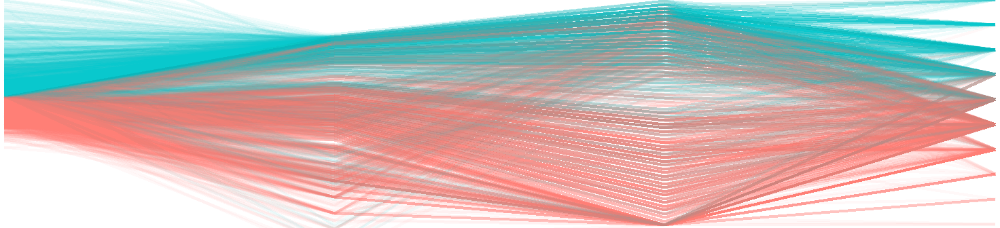

# Graph portfolio    

Your name    
Date published    


(Place an image with a brief caption to illustrate your best work.)    
```{r echo = FALSE, out.width = "90%"}
library("knitr")
opts_knit$set(root.dir = ".")

```
<small><br>
Ames Iowa Housing, a parallel-coordinate plot adapted from Visual data exploration by Bradley Boehmke. 
</br></small>


  


## Introduction

Your prose.   


## Displays and critiques 

[Display 1](reports/d1.md) Title of your graph    
State the type of graph (strip plot or box plot) and summarize the main points of the report.    

[Display 2](reports/d2.md) Title of your graph    
State the type of graph (multiway dot plot) and summarize the main points of the report.    

[Display 3](reports/d3.md) Title of your graph    
State the type of graph (scatterplot) and summarize the main points of the report.    

[Display 4](reports/d4.md) Title of your graph    
State the type of graph (dot plot, line graph, or scatterplot) and summarize the main points of the report.    

[Display 5](reports/d5.md) Title of your graph    
State the type of graph (dot plot, line graph, or scatterplot) and summarize the main points of the report.    

[Display 6](reports/d6.md) Title of your graph    
State the type of graph (co-plot, scatterplot matrix, or parallel coordinate plot) and summarize the main points of the report.    

[Display 7](reports/d7.md) Title of your graph    
State the type of graph (cycle plot, financial plot, diverging stacked bar, etc.) and summarize the main points of the report.    


## Discussion notes 

[Reading prompts 1](reports/reading-prompts-1.Rmd) Tufte (1997) Decision to launch Challenger    
[Reading prompts 2](reports/reading-prompts-2.Rmd) Wainer (2014) 15 displays about one thing    
[Reading prompts 3](reports/reading-prompts-3.Rmd) Dragga and Voss (2001) Cruel pies    
[Reading prompts 4](reports/reading-prompts-4.Rmd) Kostelnick (2007) Conundrum of clarity    
[Reading prompts 5](reports/reading-prompts-5.Rmd) Spence (2006) Playfair & psychology of graphs      

[Presentation prompts](reports/presentation-prompts.md)    
Your prose as needed.    
