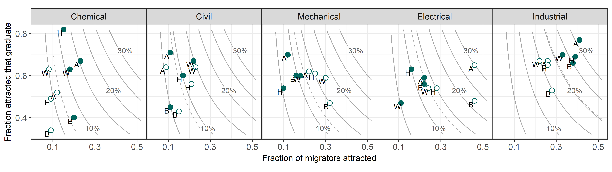

# Portfolio of data displays

Richard Layton  
2018-11-27

Your portfolio cover art is your audience’s first interaction with your
data display work. Use your best work here to attract the reader’s
attention, pique their curiosity, and invite them to read further.

## Introduction

A portfolio documents your professional growth and competence by
providing tangible evidence of your knowledge and skills in data
visualization and visual rhetoric. The introduction is the reader’s
first glimpse of your work; give them a reason to keep reading.

Even if your repo is private, treat these pages as if you intended to
make them available to a prospective employer.

## Displays and critiques

This is the main body of the portfolio. Each link takes the reader to a
stand-alone report about a specific display, its data, critique, and
references.

Give each report a descriptive title and indicate the type of graph
used, e.g., histogram, scatterplot, parallel coordinate plot, etc. While
the course is in session, please leave the tags D1, D2, etc., for my
convenience. When the course concludes, of course, you may edit these
labels as you wish.

  - [D1 Title](reports/d1.md) (graph type)
  - [D2 Title](reports/d2.md) (graph type)  
  - [D3 Title](reports/d3.md) (graph type)
  - [D4 Title](reports/d4.md) (graph type)
  - [D5 Title](reports/d5.md) (graph type)
  - [D6 Title](reports/d6.md) (graph type)
  - [D7 Title](reports/d7.md) (graph type)

## Discussion notes

These notes are from weekly small-group discussions in class that
include the student’s own ideas and peer feedback. The purpose of the
notes is to inform the critiques.

  - [Reading prompts](reports/reading-prompts.md) (5 total) Complete
    before class on the due date.
  - [Presentation prompts](reports/presentation-prompts.md) (7 total)
    Substantially complete (except for peer comments) before class on
    the due date.
